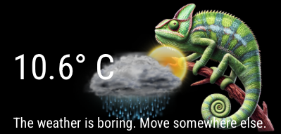

# MMM-ChameleonWeather

🦎 **MMM-ChameleonWeather** is a fun and visually dynamic [MagicMirror²](https://magicmirror.builders) module that shows a chameleon whose appearance changes depending on the temperature and weather conditions.

---

## Features

- 🐸 Chameleon image changes with temperature ranges
- 🌦 Weather overlay icons based on OpenWeatherMap `id` or `icon`
- 🌡 Optional temperature display (Celsius or Fahrenheit)
- 🔄 Periodic weather updates (default every 5 minutes)
- 🧩 Fully configurable image sets for both temperature and weather overlays

---

## Screenshot



---

## Installation

```bash
cd ~/MagicMirror/modules
git clone https://github.com/ChrisF1976/MMM-ChameleonWeather.git
```

## Configuration

Add the module to your config.js file:
```javascript
{
  module: "MMM-ChameleonWeather",
  position: "top_center", // Or any position you prefer
  config: {
    apiKey: "YOUR_OPENWEATHERMAP_API_KEY",
    lat: "YOUR_LATITUDE",
    lon: "YOUR_LONGITUDE",
    units: "metric", // or "imperial"
    updateInterval: 5 * 60 * 1000, // every 5 minutes
    showTemperature: true,
    width: "300px",
    weatherImagePath: "/image/weather/",
    temperatureRanges: [
      { range: [-Infinity, 0], image: "/image/frog/chameleon_below0.png" },
      { range: [0, 10], image: "/image/frog/chameleon_to10.png" },
      { range: [10, 20], image: "/image/frog/chameleon_to20.png" },
      { range: [20, 30], image: "/image/frog/chameleon_to30.png" },
      { range: [30, Infinity], image: "/image/frog/chameleon_above30.png" }
    ]
  }
}
```

## Configuration Options

| Option               | Type     | Default                    | Description                                                                 |
|----------------------|----------|----------------------------|-----------------------------------------------------------------------------|
| `apiKey`             | string   | `""`                       | **Required**. Your [OpenWeatherMap](https://openweathermap.org/) API key.  |
| `lat`                | string   | `""`                       | **Required**. Your latitude for weather data.                               |
| `lon`                | string   | `""`                       | **Required**. Your longitude for weather data.                              |
| `units`              | string   | `"metric"`                 | Unit system: `"metric"` or `"imperial"`.                                    |
| `updateInterval`     | number   | `5 * 60 * 1000` (5 min)    | Update interval in milliseconds.                                            |
| `showTemperature`    | boolean  | `true`                     | Whether to display the current temperature.                                 |
| `width`              | string   | `"300px"`                  | Width of the module display.                                                |
| `weatherImagePath`   | string   | `"/image/weather/"`        | Path to the folder containing weather overlay icons.                        |
| `useWeatherMapping`  | boolean  | `true`                     | Enables weather-to-overlay mapping via weather `id` or `icon`.              |
| `temperatureRanges`  | array    | See default below          | Maps temperature ranges to chameleon images.                                |

### Example `temperatureRanges`

```javascript
temperatureRanges: [
  { range: [-Infinity, 0], image: "/image/frog/chameleon_below0.png" },
  { range: [0, 10], image: "/image/frog/chameleon_to10.png" },
  { range: [10, 20], image: "/image/frog/chameleon_to20.png" },
  { range: [20, 30], image: "/image/frog/chameleon_to30.png" },
  { range: [30, Infinity], image: "/image/frog/chameleon_above30.png" }
]
```

**Each object should define:**
- range: A two-element array [minTemp, maxTemp].
- image: Path to the image displayed for that temperature range.

## License

MIT © [ChrisF1976]
